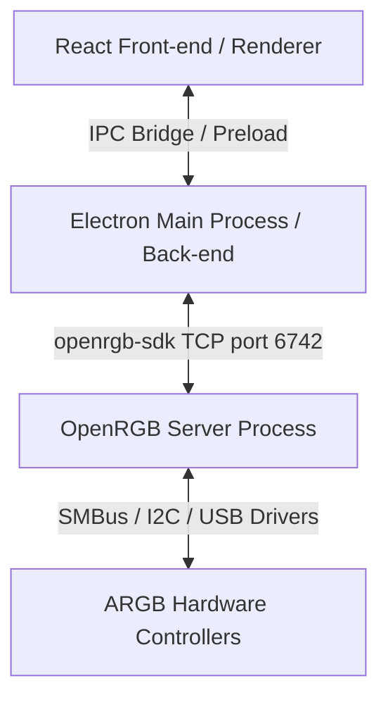

# Arquitetura e Guia de Desenvolvimento - Kosak Fan RGB

Este documento detalha o funcionamento interno, a estrutura do projeto e as diretrizes para manutenção do **Kosak Fan RGB**.

---

## 🛠️ Visão Geral da Arquitetura

O aplicativo segue o modelo de processo padrão do Electron, dividindo as responsabilidades entre o Processo Principal (Back-end) e o Processo de Renderização (Front-end).



### 1. Processo Principal (`electron/main.js`)
É o ponto de entrada do aplicativo. Executa no ambiente nativo do Node.js e tem acesso a recursos do sistema operacional. Suas principais responsabilidades são:
- **Ciclo de vida do app**: Criação de janelas, controle de instância única (Single Instance Lock).
- **Gerenciamento do OpenRGB**: Inicializa e encerra a instância embutida do executável `OpenRGB.exe` em segundo plano (`--server`).
- **Persistência de Dados**: Carrega e salva as configurações de cor e preferências do usuário em um arquivo JSON local (`settings.json`).
- **System Tray (Bandeja do Sistema)**: Cria e gerencia o ícone de bandeja, redirecionando o evento de fechamento da janela principal para ocultá-la.
- **Autostart**: Gerencia a ativação da inicialização do Windows via registro nativo (`app.setLoginItemSettings`).

### 2. Script de Pré-carregamento (`electron/preload.js`)
Configura a ponte segura (IPC) entre o front-end web e as APIs nativas do Electron, expondo um objeto global `window.electronAPI`.
- Compilado especificamente em formato **CommonJS** para compatibilidade com o Electron.

### 3. Processo de Renderização (`src/`)
Interface de usuário reativa construída com React, Vite e CSS vanilla:
- **`src/App.jsx`**: Gerencia o estado da interface, lê as configurações salvas enviadas pelo Electron, exibe a paleta de cores (`react-colorful`) e envia eventos IPC para atualizar o hardware.
- **`src/index.css`**: Design system com variáveis de cores CSS personalizadas e estilo dark premium com efeitos de translucidez (glassmorphism).

---

## 🔄 Comunicação IPC (Inter-Process Communication)

A comunicação entre a UI React e o processo principal do Electron é feita através dos seguintes canais expostos no `preload.js`:

| Canal | Tipo | Descrição |
|---|---|---|
| `get-devices` | Invoke/Handle | Obtém a lista atualizada de dispositivos controláveis e suas contagens de LEDs. |
| `update-leds` | Invoke/Handle | Envia um array de cores RGB para atualizar o dispositivo selecionado no hardware. |
| `get-settings` | Invoke/Handle | Recupera o objeto de configurações persistidas no `settings.json`. |
| `save-settings` | Invoke/Handle | Salva e atualiza as configurações, além de atualizar o autostart no SO. |
| `retry-connection` | Invoke/Handle | Executa um scan forçado reabrindo a comunicação do SDK com o hardware. |
| `init-complete` | Send/On | Evento enviado pelo Electron à UI informando o status inicial do motor de hardware. |

---

## 🗄️ Detalhes de Implementação Críticos

### Persistência de Cores
O arquivo `settings.json` é armazenado na pasta `%APPDATA%/Kosak Fan Rgb/settings.json` do usuário. O formato de dados esperado é:
```json
{
  "color": "#aa3bff",
  "brightness": 100,
  "startWithWindows": false,
  "startHidden": false
}
```

### Inicialização do Hardware (OpenRGB)
Ao inicializar, o processo do Node.js:
1. Encerra qualquer processo órfão do `OpenRGB.exe` rodando no Windows.
2. Inicia o OpenRGB embutido na pasta `bin/OpenRGB` (que inclui os drivers `Smbus*.bin` e `PawnIOLib.dll` necessários para placas-mãe ASUS/ASRock/MSI).
3. Aguarda a inicialização da porta TCP `6742`.
4. Conecta via SDK e busca por zonas ARGB com contagem inválida de LEDs (redimensionando automaticamente zonas vazias para 80 LEDs).
5. Carrega o `settings.json` e aplica a última cor configurada.

---

## 🏗️ Pipelines de Compilação

Para empacotar o projeto em um instalador único:
1. Execute `npm run build`.
2. O Vite transpilará o código React para a pasta `/dist`.
3. O Vite transpilará o código Electron para `/dist-electron`.
4. O `electron-builder` compactará os binários necessários (incluindo a pasta `bin/` com OpenRGB) e criará o executável de instalação sob as configurações do arquivo `package.json`.
